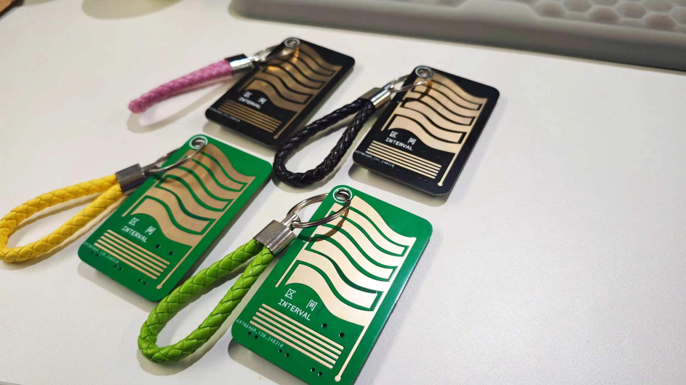
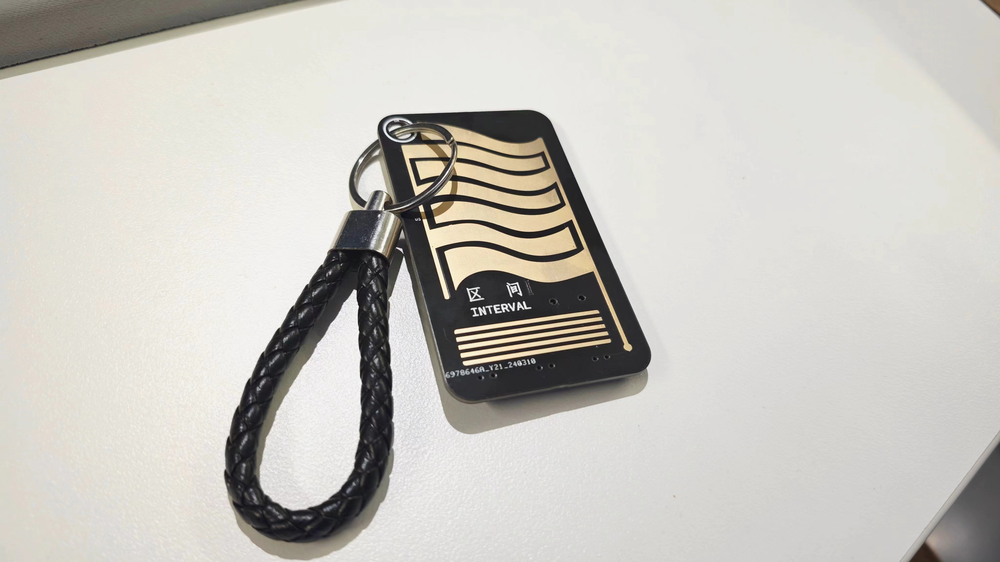
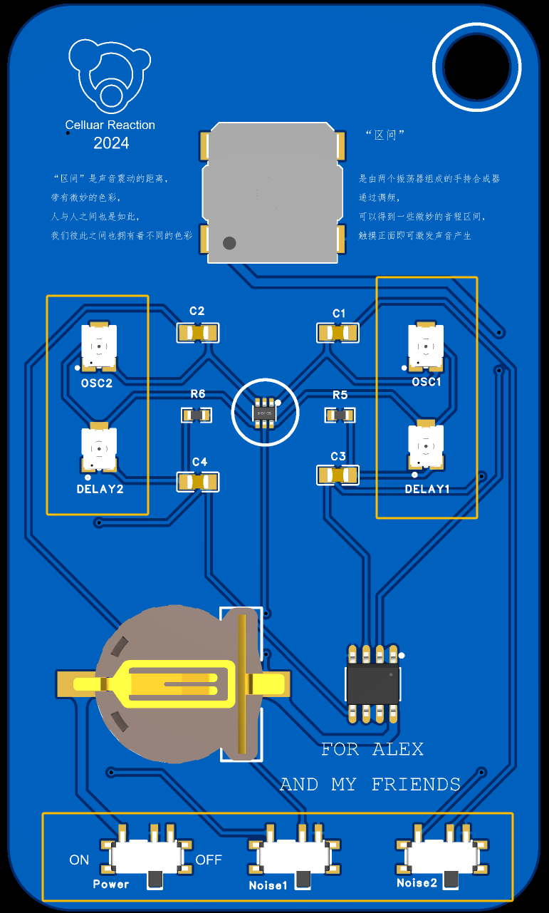
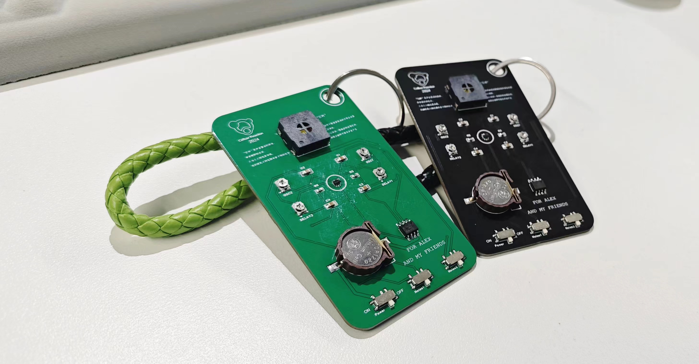

# Interval - A dinky sound toy

# Introduction

“Interval” (”区间” in Chinese), is a small handheld sound toy. It uses two Schmidt triggers () as oscillators, and two capacitor charge and discharge circuits as env controller.

You can touch the bonding pad to trigger different sounds. With two potentiometers controlling frequence of two osc, you sometimes can get interesting sound intervals. That’s why this dinky toy was named “Interval”. And there are also two potentiometers for controlling release time. Different settings can lead different sounds. - Maybe bird chirp, creak or NES style noise.

The design inspiration was from an argument with Alex. After that wrangle, I was thinking that the relationship between people was kind of like the relationship between two musical notes. The variation of the intervals of two notes can represent many feelings. So I design this card like sound toy, try to show this experience in sonic art.

You can find the semantics in the file folder, and you may say that’s very simple. But for me, making this dinky sound toy let me feel exciting in the first time. From a concept, fixed with suitable technique, and finally make it happen, building this toy is not about a funcy technological journey, but an artistic expression with electronic.

# How to play

Just turn on the on/off switch, and touch the bonding pad on the other side, you will hear the sound from the small speaker.Because the power source is only 3V, the volume is not too big to interrept other people. But sometimes it may be covered by other noise, so it’s better to play with it in a relatively peace place.

Look the back side with electronic components, there are four potentiometers. I used SMD, you can use a tool like screwdriver or just use your fingernail (assume you have the proper length) to change the potentiometers’ value.

Two with “osc” characters is for frequence changing, two with “delay” characters is for adjusing sound release time. Besides On/Off switch in the left corner, there are two switches with “noise” characters. Turn on those swtiches will change the connect direction of the capacity in Schmidt Oscillator circuit. The basic connection is “capacity to GND”, the switch version is “capacity to touch pad”, which is the stripe in the front. With two hands operation, you can create more interesting sound.

# Build Your Own

The electronic components I used in “Interval” were pretty basic. You can build all circuits on one breadboard. You can use chip like CD40106 to set up the Schmidt trigger osc just with one potentiometer and one capacity. Feel free to make your hands dirty!

